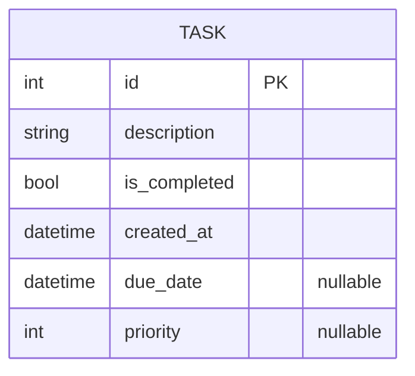

# Simple Task App - Dokumentasi MVP

Dokumen ini berisi rangkuman **PRD, SRS, SDD, ERD, dan Timeline Sprint MVP** untuk aplikasi *Simple Task App*.  
Tujuan dokumen ini adalah menjadi referensi utama bagi tim developer dalam membangun dan merilis MVP.

---

## 1. Product Requirement Document (PRD)

### 1.1 Latar Belakang
Pengguna membutuhkan aplikasi sederhana untuk mengelola daftar tugas harian.  
MVP fokus pada fungsi inti: menambah, melihat, menandai selesai, dan menghapus tugas.

### 1.2 Tujuan Produk
- Membantu pengguna mengelola tugas sehari-hari secara efisien.  
- Menyediakan UI sederhana, intuitif, dan cepat digunakan.  

### 1.3 Fitur Utama (MVP)
- Tambah tugas baru.  
- Lihat daftar tugas.  
- Tandai tugas selesai/belum selesai.  
- Hapus tugas.  
- Simpan data secara lokal menggunakan SQLite (via Drift).  

---

## 2. Software Requirement Specification (SRS)

### 2.1 Fungsional
- Sistem harus memungkinkan pengguna menambah tugas baru dengan deskripsi.  
- Sistem harus menyimpan status setiap tugas (selesai/belum).  
- Sistem harus menyimpan data secara persisten walaupun aplikasi ditutup.  
- Sistem harus menyediakan mekanisme untuk menghapus tugas.  

### 2.2 Non-Fungsional
- **Usability:** UI sederhana dengan interaksi minimal.  
- **Reliability:** Data tetap aman walaupun aplikasi di-restart.  
- **Performance:** Aplikasi dapat menampilkan daftar tugas < 1 detik.  
- **Compatibility:** Mendukung Android minimum SDK 21.  

---

## 3. Software Design Document (SDD)

### 3.1 Arsitektur
Menggunakan arsitektur **Clean Architecture** dengan 3 lapisan utama:
- **Data Layer** → Drift (SQLite) untuk penyimpanan lokal.  
- **Domain Layer** → Entitas, Use Cases, dan Repository interface.  
- **Presentation Layer** → Flutter UI dengan Riverpod untuk state management.  

### 3.2 Teknologi & Dependensi
- **Flutter**  
- **Riverpod & Hooks**  
- **Drift (SQLite)**  
- **Freezed & Build Runner** untuk code generation  
- **Go Router** untuk navigasi  

---

## 4. Entity Relationship Diagram (ERD)

### 4.1 Entitas Utama
**Task**
- `id` (PK) : int  
- `description` : string  
- `is_completed` : bool  
- `created_at` : datetime  
- `due_date` : datetime (nullable)  
- `priority` : int (nullable)  

### 4.2 Visualisasi ERD (Mermaid)

---

## 5. Timeline Sprint MVP

**Estimasi Durasi:** 2 Minggu

### Minggu 1: Fondasi & Read Task
- Hari 1: Setup proyek, dependensi, konfigurasi database.  
- Hari 2: Implementasi Data Layer (datasource & repo).  
- Hari 3: Implementasi Domain Layer (entitas, use case, repo impl).  
- Hari 4: Presentation Layer (tampilan awal & daftar tugas).  
- Hari 5: Tampilan task item & integrasi awal.  

### Minggu 2: CRUD Lengkap & Refinement
- Hari 1: Tambah tugas baru (logika & UI).  
- Hari 2: Tandai selesai/belum selesai.  
- Hari 3: Hapus tugas.  
- Hari 4: Refinement UI/UX, bugfix, edge cases.  
- Hari 5: Pengujian akhir, finalisasi kode, persiapan rilis.  

---

## 6. Catatan Tambahan
- Gunakan `flutter pub run build_runner build --delete-conflicting-outputs` setiap ada perubahan pada Freezed, Drift, atau Riverpod Generator.  
- Prioritaskan fungsi inti MVP sebelum menambahkan fitur lanjutan.  
- Dokumentasi ini menjadi acuan untuk sprint berikutnya.
